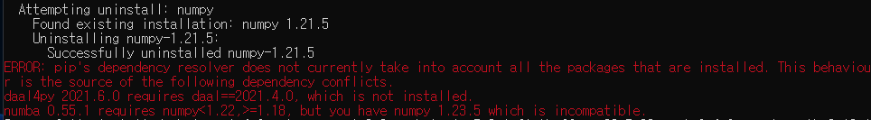

| 구분 | 개발환경 | 추가 날짜 | 내용 | 해결 |
| -- |---|---|---|---|
| [INSTALL_01](#install-01) | OS : Window 11  | 2023/06/12 |기본 설치 <br> tensorflow 설치 시, 에러 발생  | 재 설치 명령을 한번 더 실행하면 에러 메시지가 없어짐. |
| MAC | --  | -- | --- |


### INSTALL_01 {#install-01}
* 증상
   * 아래 명령으로 tensorflow를 설치 시, 에러 발생.
```
pip install tensorflow
```

* 내용


* 해결
   * 설치 명령을 한번 더 실행하면 에러 메시지가 없어짐.
```
pip install tensorflow
```

### INSTALL_01
* 내용


* 해결